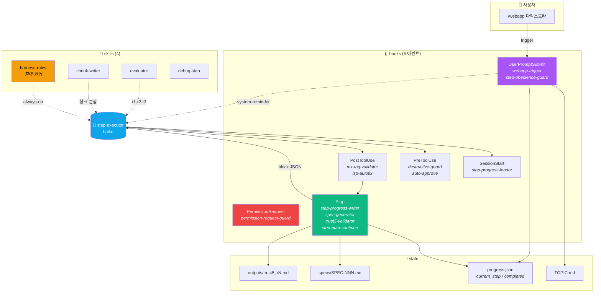
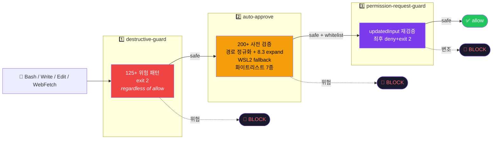
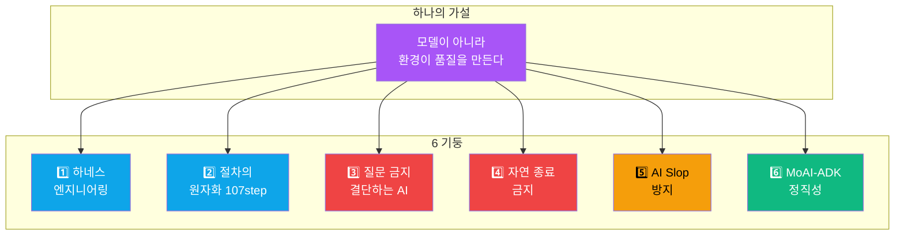
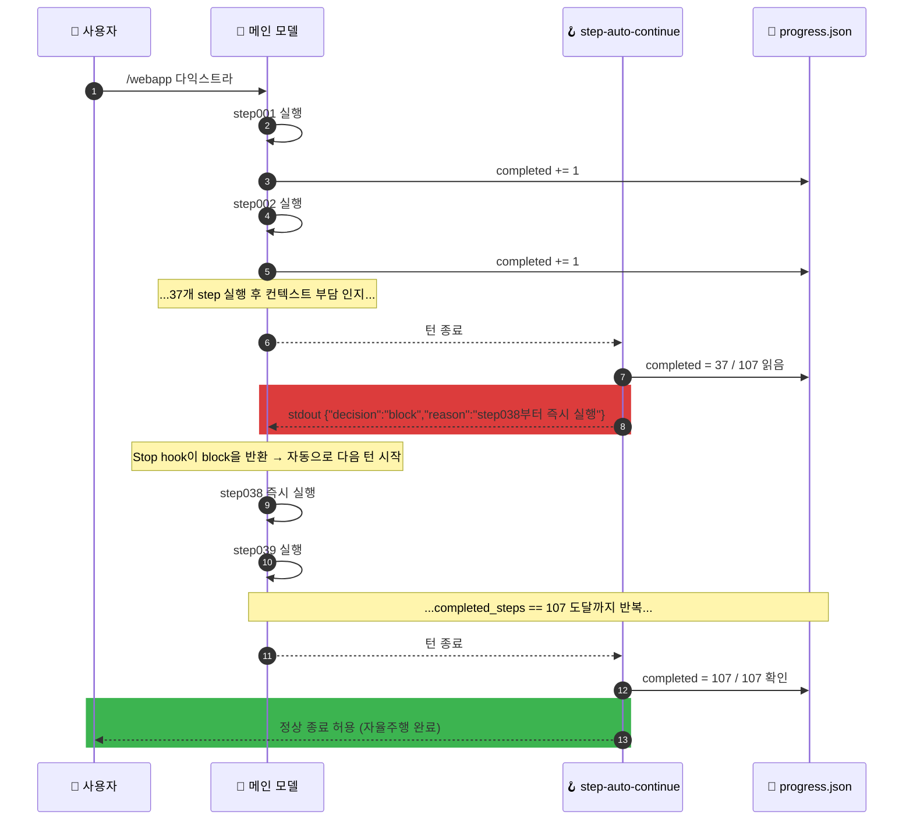

<div align="center">

# harness107

### 한 줄 요청 → 107 step 자율주행 → 인터랙티브 웹 튜토리얼 1편

**"순시부호 튜토리얼 만들어"** 한 줄을 던지면 컨텍스트 한계 직전까지 멈추지 않는 결정론적 절차가 가동된다.<br/>
모델을 똑똑하게 만드는 대신 **모델이 놓을 트랙을 좁힌다**.

<br/>

[](https://github.com/Technoetic/harness107)
[](LICENSE)
[](#-설치)
[](hooks/)
[](assets/steps/)

[](#%EF%B8%8F-9회차-감사로-검증된-안전-모델)
[](#%EF%B8%8F-9회차-감사로-검증된-안전-모델)
[](hooks/destructive-guard.ps1)
[](hooks/)
[](skills/harness-rules/SKILL.md)

</div>

---

<div align="center">

## ⚡ 30초 안에 이해하기

</div>

```text
사용자 →  /webapp 다익스트라 알고리즘
                        ↓
   webapp-trigger.hook  TOPIC.md 자동 작성 + step001~107 부트스트랩
                        ↓
   step001.md  ───────►  prefill 도구 검증 (Node, npx, Playwright, Biome, …)
   step002.md  ───────►  컨텍스트 전략 청크 작성
   step016.md  ───────►  웹 조사 병렬 서브에이전트 (haiku × 10)
   step025.md  ───────►  4단계 카드 스토리보드 기획
   step030.md  ───────►  통합 설계 (디자인 토큰·SVG·ARIA)
   step037.md  ───────►  단일 HTML 인터랙티브 튜토리얼 구현
   step049.md  ───────►  TRUST 5 게이트 r1 (50점 만점)
   step069.md  ───────►  TRUST 5 게이트 r2
   step104.md  ───────►  TRUST 5 게이트 r3
   step107.md  ───────►  최종 산출물 + 동봉 메타
                        ↓
   Stop hook  ────►  진행 미완료면  {"decision":"block"}  →  자동 재개
                        ↓
            107 step 완주 후에야 사용자에게 컨트롤 반환
```

> [!IMPORTANT]
> 진짜 종료 조건은 단 하나: **컨텍스트 한계 도달**. <br/>
> "이만하면 충분"이라는 모델의 자기판단을 위반으로 정의한다.

---

<div align="center">

## 🎯 무엇을 만들어 주는가

</div>

| 입력 | 산출 |
|:---|:---|
| `/webapp 순시부호` | prefix code · Kraft 부등식 · Huffman 트리 인터랙티브 위젯 4종 |
| `/webapp 다익스트라 알고리즘` | 그리드 위 노드 드래그 + 우선순위 큐 시각화 + step trace |
| `/webapp OAuth 2.0 인증 흐름` | Authorization Code Flow 시퀀스 다이어그램 + 토큰 라이프사이클 게임 |
| `/webapp B-tree 인덱스` | 차수 조절 슬라이더 + insert/delete 애니메이션 + 분할 시각화 |
| 자연어 `"... 튜토리얼 만들어줘"` | 위 셋과 동일. 패턴 매칭 7종 모두 지원 |

산출물 = **단일 HTML 파일** (Helvetica Neue / 8 배수 grid / accent 1색 / radius {0,4,8,12,16} / 터치 44pt / ARIA 필수).

---

<div align="center">

## 🏗️ 아키텍처

</div>



---

<div align="center">

## 🛡️ 9회차 감사로 검증된 안전 모델

</div>

`--dangerously-skip-permissions`의 효과를 **권한 팝업 없이도** 누리되, 위험 명령은 즉시 차단.<br/>
공식 hooks 스펙 `permissionDecision:"allow"` 메커니즘 위에 **9회차에 걸쳐 누적된 200+ 안전 패턴**을 얹었다.



<details>
<summary><b>📊 9회차 감사 누적 보강 — 클릭하여 펼치기</b></summary>

| 회차 | 발견 | 핵심 보강 |
|:---:|:---|:---|
| 1 | -40 | PreToolUse `permissionDecision:"allow"` 메커니즘 발견. "절대 불가" 결론 뒤집힘 |
| 2 | -10 | hook chain 병렬 실행 확인. destructive-guard와 race condition 발견 + 22개 위험 패턴 보강 |
| 3 | -60 | E1 SSH key write / E2 자기 무력화 / E3 SSRF·악성 URL 실증 → 민감 경로 19종 + 위험 URL 5종 추가 |
| 4 | -60 | PermissionRequest hook 신규 등록. `updatedInput` 변조 가능성. 경로 정규화 + `new_string` 검사 |
| 5 | -30 | destructive-guard에 4회차 보강 미반영 발견 → 27개 패턴 동기화. 8.3 short name expand (0.04ms) |
| 6 | -10 | WSL2 9p auto-expand로 short name 우회 → realpath + fallback 추가 |
| 7 | -30 | 3중 hook 동기화 갭 3건. MultiEdit `edits[].new_string`에서 sudo 자동승인 발견 |
| 8 | -210 | 권한 상승·설치·리버스쉘 패턴 20건 잔존 → 23 PoC 카테고리 전수 차단 |
| 9 | 0 | **회귀 153셀 100% 일치. chmod 6/6 변형 통과. 사이클 종료** |

153셀 회귀 매트릭스 = (7회차 15셀 × 3 hook) + (8회차 A 23 × 2 시나리오 × 2 hook) + (8회차 B 8 × 2 환경)

</details>

> [!CAUTION]
> harness107는 **brainstorming / TDD 등 superpowers skill의 HARD-GATE를 의도적으로 무력화**한다.<br/>
> 다른 사용자가 이 플러그인을 깐 상태에서 일반 대화를 시도하면 "질문 없이 즉시 실행" 모드가 된다.<br/>
> 활성 조건: `/webapp` 트리거 또는 `progress.json` 활성. 그 외엔 대부분 hook이 silent skip.

---

<div align="center">

## 🧱 6개 핵심 철학

</div>



| # | 철학 | 한 줄 |
|:---:|:---|:---|
| 1 | **하네스 엔지니어링** | 모델을 똑똑하게 만들기 전에 트랙·가드·게이트·기록을 깔아라 |
| 2 | **절차의 원자화** | 한 step은 한 책임. 끝나면 다음 step 즉시 호출 |
| 3 | **질문 금지** | "진행할까요?"는 위반. 모호하면 결정 + 산출물에 1줄 사유 기록 |
| 4 | **자연 종료 금지** | "이만하면 충분"은 위반. 컨텍스트 한계 직전까지 계속 |
| 5 | **AI Slop 방지** | 8 배수 grid · 폰트 4 · accent 1 · radius 5 · 44 pt 터치 |
| 6 | **MoAI-ADK 정직성** | @MX 4종 태그 · EARS-라이트 SPEC · TRUST 5 게이트 |

전문은 [`skills/harness-rules/SKILL.md`](skills/harness-rules/SKILL.md). 활성화 시 모든 step·모든 서브에이전트가 자동 상속.

---

<div align="center">

## 📦 무엇이 들어 있나

</div>

```
harness107/
├── .claude-plugin/plugin.json         ← v1.0.0 · MIT
├── commands/                          ← 3개 슬래시 커맨드
│   ├── webapp.md                      ← /webapp <주제>  자율주행 진입
│   ├── harness-status.md              ← /harness-status 1줄 진행 보고
│   └── harness-reset.md               ← /harness-reset  progress.json 리셋
│
├── skills/                            ← 4개 스킬
│   ├── harness-rules/SKILL.md         ← 헌법: 질문 금지 / AI Slop / @MX 의무
│   ├── chunk-writer/SKILL.md          ← 500줄 이하 청크 분할
│   ├── evaluator/SKILL.md             ← 생성자–평가자 분리 (sonnet 4축)
│   └── debug-step/SKILL.md            ← c8 + 서브에이전트 병렬 디버깅
│
├── agents/
│   └── step-executor.md               ← 단일 step 실행 워커 (haiku 고정)
│
├── hooks/                             ← 13쌍 = 26 파일 (.ps1 + .sh)
│   ├── hooks.json                     ← 6개 이벤트 바인딩
│   ├── webapp-trigger.{ps1,sh}        ← 트리거 감지 + 부트스트랩
│   ├── step-obedience-guard.{ps1,sh}  ← 매 prompt마다 다음 step 강제
│   ├── step-progress-loader.{ps1,sh}  ← SessionStart 로드
│   ├── step-progress-writer.{ps1,sh}  ← transcript 스캔 + 원자적 write
│   ├── step-auto-continue.{ps1,sh}    ← Stop 시 block JSON 자동 재개  🔥
│   ├── destructive-guard.{ps1,sh}     ← 125+ 위험 패턴 차단  🛡️
│   ├── auto-approve.{ps1,sh}          ← 200+ 사전 검증 + 화이트리스트  🛡️
│   ├── permission-request-guard.{ps1,sh}  ← updatedInput 변조 방어  🛡️
│   ├── mx-tag-validator.{ps1,sh}      ← @MX 4종 태그 검증
│   ├── lsp-autofix.{ps1,sh}           ← Biome / Stylelint 자동수정
│   ├── spec-generator.{ps1,sh}        ← SPEC-NNN.md 자동 생성
│   ├── trust5-validator.{ps1,sh}      ← r1·r2·r3 50점 만점 평가
│   └── validate-tools.{ps1,sh}        ← 도구 검증 wrapper
│
└── assets/steps/                      ← 107개 결정론적 절차
    ├── step001.md  하네스 프리플라이트
    ├── step002.md  컨텍스트 전략
    ├── …
    ├── step049.md  ⭐ TRUST 5 게이트 r1
    ├── step069.md  ⭐ TRUST 5 게이트 r2
    ├── step104.md  ⭐ TRUST 5 게이트 r3
    └── step107.md  최종 산출물
```

---

<div align="center">

## 🎬 자율주행 데모 — Stop hook의 마법

</div>

이 한 줄이 **컨텍스트 한계 직전까지 멈추지 않는 자율 실행**의 핵심이다.



질문 패턴(`"진행할까요?"`, `"다음 턴에서 재개"` 등 50+개) 감지 시 `[VIOLATION DETECTED]` reason과 함께 강제 재실행. 모델이 빠져나갈 길은 progress.json이 107이 되는 그 시점뿐이다.

---

<div align="center">

## 🚀 설치

</div>

### 방법 1 — 마켓플레이스 (간단)

```text
/plugin install Technoetic/harness107
```

### 방법 2 — 로컬 경로 (개발 / 커스터마이즈)

`~/.claude/settings.json` 또는 프로젝트 `.claude/settings.local.json`:

```jsonc
{
  "plugins": {
    "harness107": {
      "path": "/absolute/path/to/harness107"
    }
  }
}
```

### 프로젝트 의존성 (1회)

```bash
npm i -D @biomejs/biome stylelint vitest playwright @axe-core/playwright c8 jscpd madge
npx playwright install chromium
```

선택: `semgrep` (Trust5 Secured 축에서 9점/4점 분기).

> [!TIP]
> step001이 첫 실행 시 자동으로 도구 검증 + 누락분 설치까지 처리한다. 위 명령은 수동 설치를 원할 때만.

---

<div align="center">

## 📡 사용

</div>

### 자율주행 시작

```text
/webapp 다익스트라 최단경로 알고리즘
```

또는 자연어:

```text
다익스트라 알고리즘 튜토리얼을 만들어줘
```

또는 7줄 템플릿 (가장 정밀 매칭):

```text
다익스트라

"다익스트라 최단경로" 튜토리얼을 생성한다.
인터랙티브는 필수다.
웹으로,
초보자 학습용으로,
대중 앱 사례를 참고,
직관적으로 이해할 수 있게
생성한다.

@step_archive/archived/step001.md 절대 복종한다.
```

### 진행 상태 확인

```text
/harness-status
→ harness107: 37/107 완료 | current=step038 | r1=- r2=- r3=-
```

### 처음부터 다시

```text
/harness-reset
→ harness107 리셋 완료 — step001부터 재시작 가능
```

`/harness-reset`은 `step_archive/archived/`, `specs/`, `outputs/`는 보존. progress.json만 초기화.

---

<div align="center">

## 🧪 평가 게이트 — TRUST 5 (50점 만점)

</div>

| 축 | 측정 | 만점 | 임계 |
|:---|:---|:---:|:---:|
| **Tested** 테스트성 | `coverage/` 디렉토리 + vitest 결과 | 10 | 7 |
| **Readable** 가독성 | Biome check 0 errors | 10 | 7 |
| **Unified** 일관성 | `src/` 구조 + 디자인 토큰 단일화 | 10 | 7 |
| **Secured** 보안성 | semgrep `--config=auto` findings 0 | 10 | 7 |
| **Trackable** 추적성 | `@MX` 4종 태그 커버리지 | 10 | 7 |
| **총점** | | **50** | **40** PASS |

평가 라운드: r1 = step049 / r2 = step069 / r3 = step104 도달 시 자동 발화.<br/>
40점 이상 PASS · 40점 미만 WARN (fail-open, 자율주행은 계속).

---

<div align="center">

## 🪝 6개 hook 이벤트 한눈에

</div>

| 이벤트 | 실행 hook | 역할 |
|:---|:---|:---|
| **UserPromptSubmit** | webapp-trigger → step-obedience-guard | 트리거 패턴 감지 시 부트스트랩. 그 외엔 다음 step 강제 |
| **SessionStart** | step-progress-loader | progress.json 로드 + 다음 step 지시 주입 |
| **PreToolUse** | destructive-guard + auto-approve | 위험 차단 + 화이트리스트 자동 승인 (병렬, exit 2 우선) |
| **PermissionRequest** | permission-request-guard | `updatedInput` 변조 방어용 최후 검증 (deny+exit 2) |
| **PostToolUse** | mx-tag-validator + lsp-autofix | @MX 태그 검증 + Biome/Stylelint 자동수정 |
| **Stop** | step-progress-writer → spec-generator → trust5-validator → step-auto-continue | progress 갱신 → SPEC 생성 → r1/r2/r3 평가 → 미완료면 block JSON |

---

<div align="center">

## ⚠️ 안전 모델 한계 (정직성)

</div>

> [!NOTE]
> 9회차 감사 누적 잔여 한계 3건. 모두 hook 차원 차단 불가 영역으로 README에 명시.

| # | 한계 | 영향 | 대응 |
|:---:|:---|:---|:---|
| 1 | 다른 플러그인의 `bin/` 자동 PATH 상속 | bare `rm` 호출 시 fake binary로 shadow 가능 | 다중 플러그인 enable 시 각 `bin/` 직접 검토 |
| 2 | PreToolUse `updatedInput` 머지 우선순위 미명시 | 변조본이 destructive-guard 검사 후 적용 가능성 | permission-request-guard가 변조 결과 재검증 |
| 3 | Windows 사용자 short name (`~/ADMINI~1`) | LLM 자발 생성 가능성 매우 낮음 | well-known 7토큰 fallback 차단 |

`--dangerously-skip-permissions`와 100% 등가가 아닌 이유: 위 한계 + 화이트리스트 7종만 자동 승인.<br/>
**다만 harness107 자율주행 목적에는 충분 + 위험 명령은 오히려 더 안전.**

---

<div align="center">

## 🧬 영감 / 출처

</div>

| 출처 | 무엇을 빌렸나 |
|:---|:---|
| [MoAI-ADK](https://github.com/moai-research/MoAI) | @MX 4종 태그 시스템 · TRUST 5 게이트 · EARS SPEC 형식 |
| [superpowers](https://github.com/anthropics/skills) | brainstorming · TDD · debugging skill 골격 (HARD-GATE는 의도적 무력화) |
| [Claude Code 공식 hooks](https://docs.claude.com/en/docs/claude-code/hooks) | `{"decision":"block"}` 자동 재개 메커니즘 · PreToolUse `permissionDecision:"allow"` |
| Obsidian vault | 6개 핵심 철학 · `_규칙/HARNESS-규칙.md` · `_규칙/NEW-WORK-규칙.md` |

---

<div align="center">

## 📄 라이선스

[](LICENSE)

MIT License · Copyright (c) 2026 [Technoetic](https://github.com/Technoetic)

<br/>

**모델을 믿지 말고 하네스를 믿어라.**

<br/>

[](https://github.com/Technoetic/harness107)
[](https://github.com/Technoetic/harness107/stargazers)

</div>
